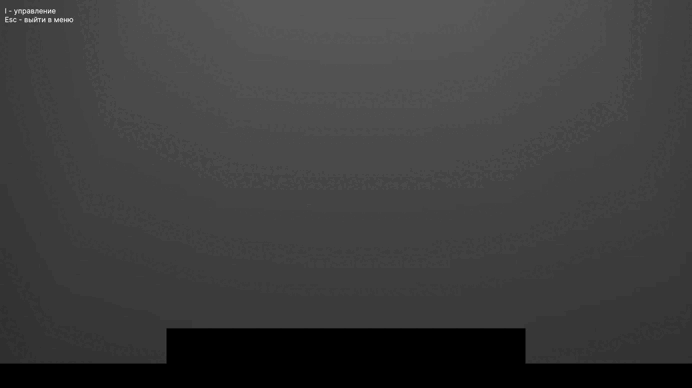
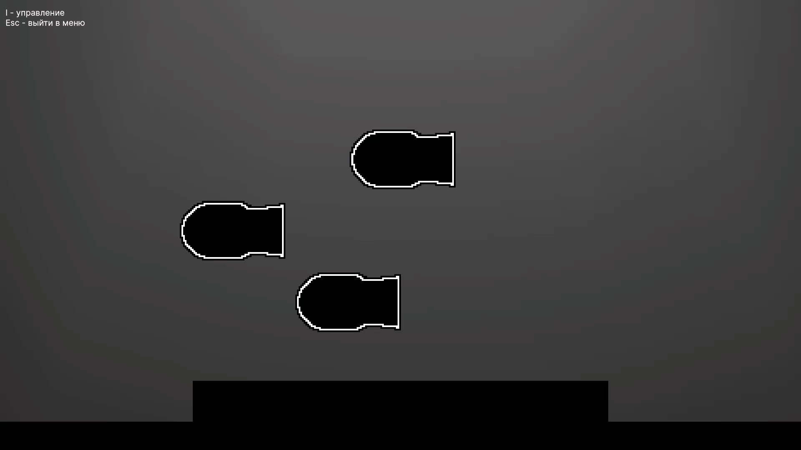

# **Back To Geometry**: Игра с Локальным Мультиплеером

Back To Geometry это соревновательная игра для нескольких игроков на одном компьютере.

Весь проект выполнен в минималистичном стиле, который акцентирует внимание на процессе игры и не будет отвлекать вас от сражения.

Основной особенностью игры является особенное поведение снаряда, выпускаемый игроком. В большинстве игр, снаряд является физическим телом, которое подвержено гравитации.
В **Back to Geometry** снаряд не подвержен стандартным физическим свойствам объекта и его движение задаётся математической формулой.
Игрок в процессе игры получает возможность менять траекторию движения снаряда, с помощью специальных бонусов найденных на локации.
Вы сможете опробовать такие функции, как тригонометрические, логарифмические, линейные, степенные и квадратичные.
В игре побеждает тот, кто наберёт заданное раннее количество очков.

Гиф

